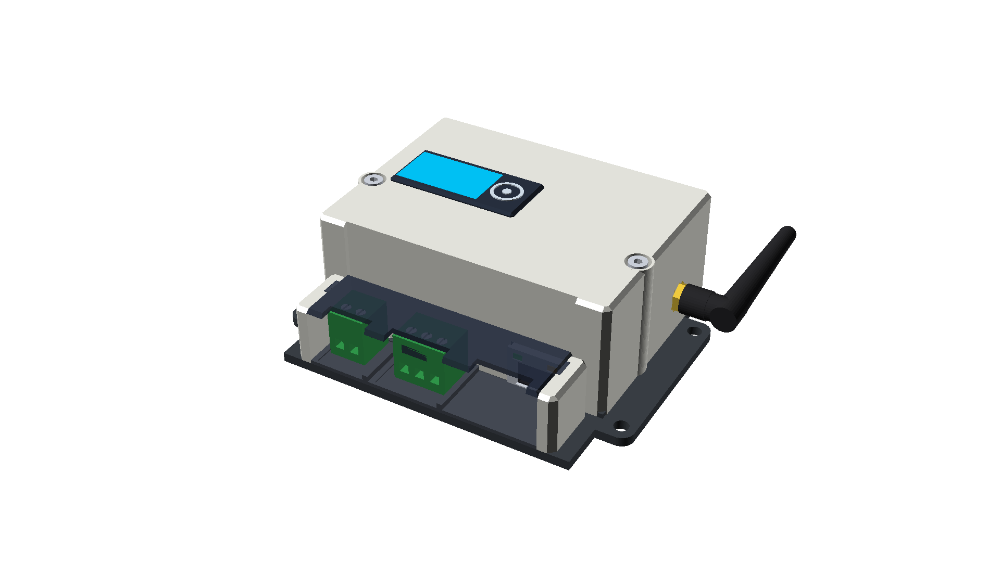
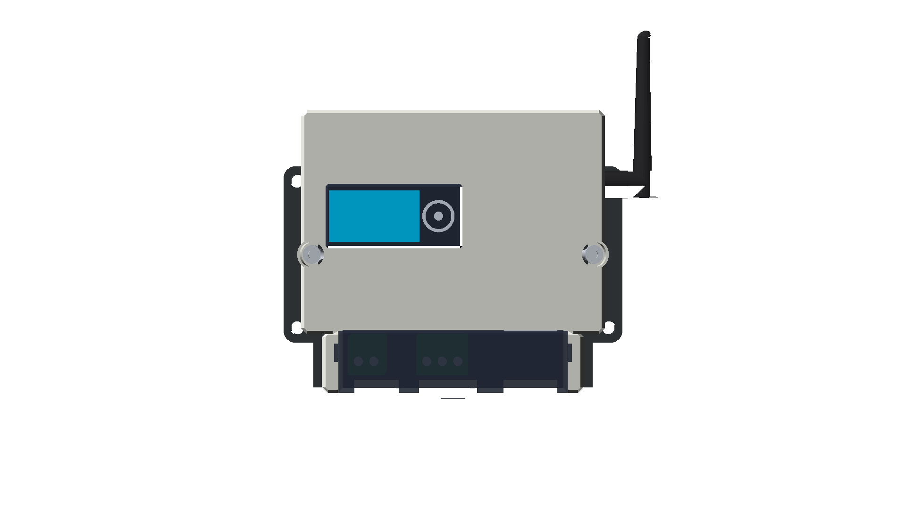
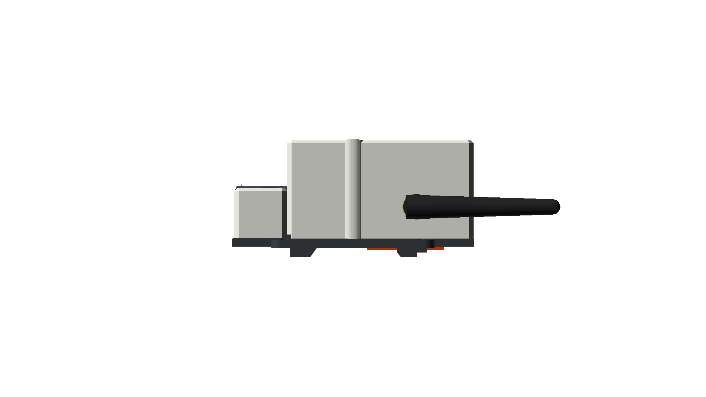
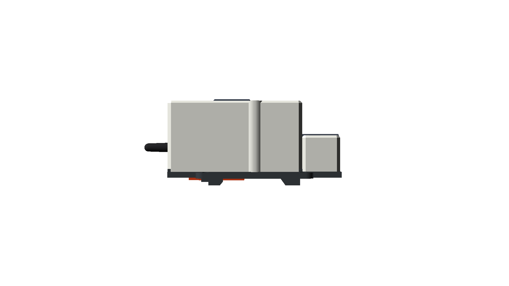

# 🏭 Desain Enclosure PLC Industrial — SEMS AIoT 2026

> **Enclosure PLC 2-01C** — Housing industri untuk modul PLC AIoT berbasis DIN Rail mounting, dirancang menggunakan OpenSCAD dengan komponen lengkap termasuk konektor Phoenix, RJ45 WAN, RS485, dan antena WiFi.

---

## 🖼️ Render 3D — Tampak 7 Sudut Pandang

### Tampak Miring (Isometrik)

---

<table>
  <tr>
    <td align="center"><b>Tampak Atas</b></td>
    <td align="center"><b>Tampak Bawah</b></td>
  </tr>
  <tr>
    <td></td>
    <td></td>
  </tr>
  <tr>
    <td align="center"><b>Tampak Depan</b></td>
    <td align="center"><b>Tampak Belakang</b></td>
  </tr>
  <tr>
    <td></td>
    <td></td>
  </tr>
  <tr>
    <td align="center"><b>Tampak Kanan</b></td>
    <td align="center"><b>Tampak Kiri</b></td>
  </tr>
  <tr>
    <td></td>
    <td></td>
  </tr>
</table>

---

## 📐 Spesifikasi Desain

| Parameter | Nilai |
|-----------|-------|
| Dimensi Luar | 115 mm × 90.4 mm × 40 mm |
| Lebar Rongga | 74.8 mm |
| Tebal Plate Bawah | 3.0 mm |
| Tinggi Shell | 37.0 mm |
| Material (Simulasi) | ABS Industri Abu-Abu |
| Mounting | DIN Rail 35 mm |

---

## 🔌 Konektivitas

| Port | Keterangan |
|------|------------|
| RJ45 | WAN / Ethernet |
| Phoenix 3P | RS485 Terminal Block |
| Phoenix 2P | DC Power IN Terminal Block |
| WiFi | Antena Eksternal (SMA Female) |

---

## 📁 File Sumber OpenSCAD

| File | Keterangan |
|------|------------|
| `plc_box.scad` | Model part utama enclosure |
| `plc_box_assembled.scad` | Assembly scene lengkap dengan semua komponen |

---

*Dibuat dengan [OpenSCAD](https://openscad.org/) — SEMS AIoT 2026*
