# Buku Panduan — Alat Perekam Data Energi (Energy Data Gateway)
*Panduan mudah untuk memahami cara kerja dan pengoperasian alat perekam data energi SEMS-AIOT v1.0.0 "Koper Demo v1" — mendukung multi power meter (hingga 4 unit sekaligus) dan kontrol 4-channel relay.*

> **Catatan versi:** dokumen ini sudah diperbarui mengikuti firmware v1.0.0. Screenshot layar OLED dan halaman web di bawah masih diambil dari versi lama (single-meter) — tampilan sebenarnya di firmware terbaru sedikit berbeda (ada menu Relay baru, halaman Modbus sekarang menampilkan hingga 4 kartu meter). Screenshot akan diperbarui pada revisi berikutnya.

---

## 1. Mengenal Bagian Luar Alat

Alat ini dibungkus dalam kotak pelindung putih yang kuat untuk penggunaan di lapangan. Di bagian bawah kotak, terdapat beberapa colokan penting untuk operasional:

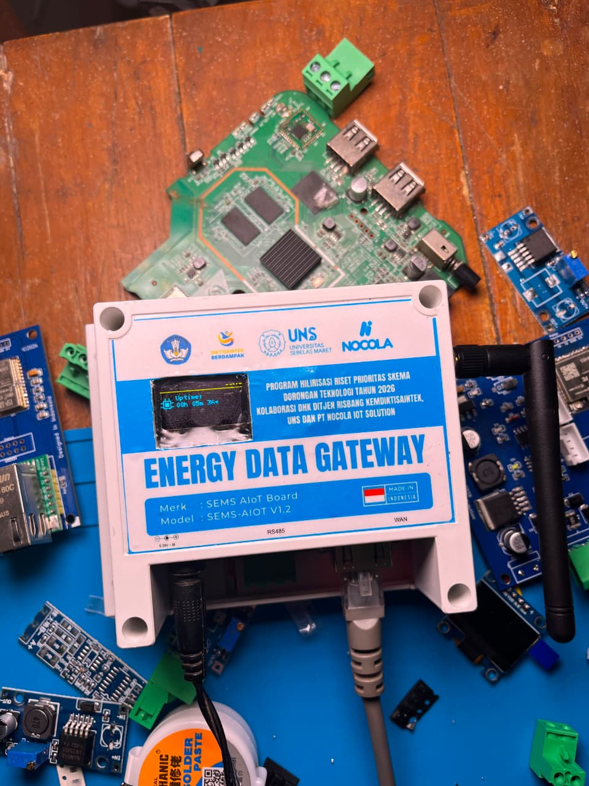

1. **Colokan Listrik (DC IN 9-36V):** Terletak di sebelah kiri bawah. Hubungkan adaptor daya DC 9V s/d 36V ke lubang ini untuk menghidupkan alat.
2. **Terminal Kabel RS485:** Terletak di tengah bawah. Jalur komunikasi serial kabel (A/B) untuk mengambil data dari perangkat meteran listrik (Modbus). Bisa disambung ke lebih dari satu meteran sekaligus dalam satu jalur (multi-drop bus).
3. **Lubang Kabel Internet LAN (WAN):** Terletak di sebelah kanan bawah. Hubungkan kabel internet LAN ke lubang ini untuk mengirimkan data ke server pusat lewat kabel.
4. **Antena Hitam (Samping Kanan):** Antena pemancar/penerima WiFi eksternal untuk koneksi internet nirkabel.
5. **Terminal Relay (4 Channel):** Empat jalur keluaran kontrol untuk menyalakan/mematikan beban listrik dari jarak jauh (lewat web atau MQTT).

---

## 2. Membaca Tampilan Layar Utama (Layar Depan)

Layar kecil di bagian depan menampilkan status koneksi alat secara langsung menggunakan simbol gambar yang mudah dipahami. Layar berputar otomatis menampilkan 5 halaman informasi setiap beberapa detik: **Dashboard → Perangkat → WiFi → LAN → MQTT**, lalu kembali ke Dashboard.

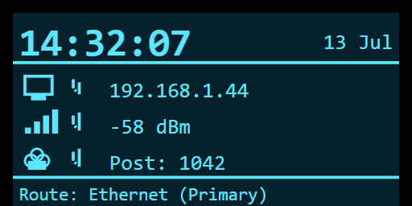

Halaman Dashboard (halaman utama) menampilkan ringkasan:

*   **Jam & Tanggal (Kuning - Atas):** Menampilkan waktu saat ini yang menyesuaikan otomatis lewat internet (NTP).
*   **Status LAN (Kabel Internet):**
    *   `[✔]` artinya kabel internet terhubung dengan baik dan alat mendapat koneksi IP.
    *   `[✘]` artinya kabel internet tidak terpasang atau tidak ada koneksi.
*   **Status WiFi (Gelombang Sinyal):**
    *   `[✔]` artinya terhubung ke WiFi (disertai informasi kekuatan sinyal).
    *   `[✘]` artinya tidak terhubung ke WiFi.
*   **Status MQTT (Pengiriman Data):**
    *   `[✔]` artinya alat berhasil terhubung ke pusat data dan aktif mengirim data perekaman (disertai angka jumlah data yang sukses dikirim).
    *   `[✘]` artinya pengiriman data ke server pusat gagal atau terputus.

### Prioritas Rute Jaringan (Kabel LAN vs WiFi)
Alat ini mendukung dua koneksi internet sekaligus secara pintar di latar belakang:
*   **Kabel LAN adalah Prioritas Utama:** Jika kabel internet LAN dicolokkan, alat akan otomatis menggunakannya sebagai rute utama pengiriman data karena koneksi kabel lebih cepat dan stabil.
*   **WiFi sebagai Cadangan (Backup):** WiFi akan tetap terhubung di latar belakang. Jika kabel LAN dicabut atau internet kabel mati, alat akan **beralih secara otomatis dan instan** menggunakan WiFi tanpa menghentikan proses pengiriman data perekaman.

### Jika WiFi Terputus atau Gagal Tersambung (Fallback Otomatis)
Alat ini punya mekanisme otomatis untuk menangani WiFi yang gagal atau terputus, tanpa perlu campur tangan pengguna:

1.  **Percobaan per Jaringan:** Setiap kali mencoba tersambung ke satu jaringan WiFi tersimpan, alat menunggu maksimal **25 detik**. Jika dalam waktu itu belum berhasil, alat otomatis pindah mencoba jaringan tersimpan berikutnya (jika Anda menyimpan lebih dari satu WiFi).
2.  **Putaran Ulang (Cycle):** Jika semua jaringan tersimpan sudah dicoba dan tidak ada yang berhasil, alat akan mengulang dari jaringan pertama lagi (putaran/cycle baru), sampai maksimal **3 kali putaran**.
3.  **AP Darurat Otomatis Menyala:** Setelah 3 putaran gagal total, alat **secara otomatis mengaktifkan kembali WiFi Access Point (AP)** `SEMS-SETUP-XXXX` di latar belakang — tanpa perlu menyentuh tombol atau mengubah Boot Mode secara manual. Ini memudahkan Anda menyambung lewat HP/laptop untuk memperbaiki pengaturan WiFi (misal ganti password atau pindah ke jaringan lain) kapan saja dibutuhkan, meskipun alat sedang dalam mode kerja Normal.
4.  **Tetap Mencoba di Latar Belakang:** Sambil AP darurat aktif, alat **tidak berhenti** mencoba tersambung ke WiFi tersimpan di latar belakang. Begitu salah satu jaringan berhasil tersambung, alat kembali normal dan melanjutkan pengiriman data seperti biasa.
5.  **Deteksi Jaringan Berubah:** Jika sebuah jaringan WiFi tiba-tiba tidak bisa disambung lagi (misalnya router diganti atau pindah channel), alat otomatis menghapus data koneksi cepat (FastConnect) lama dan mencoba menyambung ulang dari awal secara normal.
6.  **Pemantauan Sambungan Terus-menerus:** Alat memeriksa kondisi sambungan WiFi setiap saat. Jika sambungan terputus tiba-tiba (misalnya kehilangan alamat IP), alat langsung mencoba menyambung ulang tanpa menunggu.

> **Catatan:** Fallback otomatis ini berbeda dengan cara masuk Config Mode manual di Bagian 4 & 5. Anda tidak perlu melakukan apa pun — jika WiFi benar-benar tidak bisa tersambung setelah beberapa menit, AP `SEMS-SETUP-XXXX` akan muncul dengan sendirinya dan siap disambungkan.

---

## 3. Dua Tombol Fisik Alat

Alat ini punya **dua tombol fisik terpisah**, masing-masing fungsinya berbeda:

### A. Tombol Sentuh (Touch Sensor) — Navigasi Layar & Menu
Untuk menjaga kerapatan kotak agar debu tidak masuk, alat ini menggunakan satu **tombol sentuh tersembunyi** di sisi kanan layar kecil untuk navigasi menu di layar. Tombol ini tidak terlihat menonjol dari luar kotak — cukup sentuh permukaan di sebelah kanan layar OLED. Setiap kali disentuh, akan menyala **lampu indikator kecil berwarna merah** sebagai tanda sentuhan terdeteksi oleh alat.

*   **Sentuh Sekali (Ketuk/Tap):** Untuk menggeser pilihan menu ke bawah / pindah halaman info.
*   **Sentuh dan Tahan 3 Detik (Hold):** Untuk masuk ke **Menu Pengaturan** di layar.
*   **Sentuh dan Tahan 2 Detik (Hold):** Untuk memilih menu yang ditunjuk / kembali ke layar utama.

### B. Tombol BOOT — Jalan Pintas Langsung ke Config Mode
Selain tombol sentuh, alat ini juga punya **tombol tekan fisik** (BOOT button) yang berfungsi sebagai jalan pintas cepat untuk masuk ke Config Mode tanpa perlu masuk menu layar terlebih dahulu.

*   **Tekan dan Tahan 3 Detik:** Alat langsung masuk Config Mode dan restart otomatis — setara dengan langkah di Bagian 4 (Boot Mode → CFG) tapi lebih cepat, tidak perlu navigasi menu sama sekali.

> Gunakan tombol sentuh untuk melihat info status sehari-hari, dan tombol BOOT sebagai cara tercepat masuk Config Mode saat perlu ubah pengaturan.

---

## 4. Menu Pengaturan (Settings Menu) di Layar

Tahan sentuhan selama 3 detik pada layar utama untuk masuk ke menu ini:

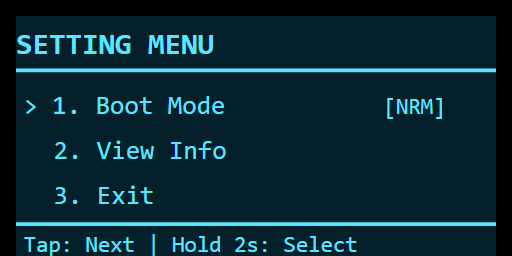

1.  **Boot Mode `[NRM / CFG]` (Mode Nyala Alat)**
    *   **Normal `[NRM]`:** Mode kerja biasa untuk membaca data dari meteran dan langsung mengirimkannya ke server pusat.
    *   **Config `[CFG]`:** Mode setting. Alat akan memancarkan WiFi sendiri (`SEMS-SETUP`) agar Anda bisa tersambung lewat HP untuk mengatur nama WiFi, alamat server, meteran, dan relay.
    *   *Cara ubah:* Geser tanda panah `>` ke menu ini, lalu **tahan sentuh 2 detik** untuk konfirmasi. Alat akan restart otomatis.
2.  **View Info (Lihat Info Detail)**
    *   Digunakan untuk melihat detail alamat IP internet, nama WiFi, dan status alat secara mendalam melalui beberapa halaman info:

        *   **Halaman 1: Informasi Alat (Uptime & Penggunaan Memori)**
            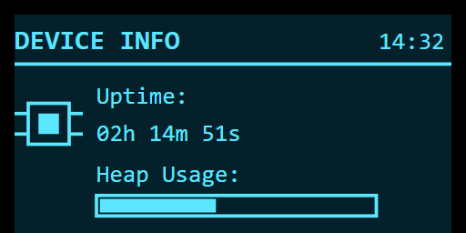
        *   **Halaman 2: Status WiFi Detail (Nama WiFi & Sinyal)**
            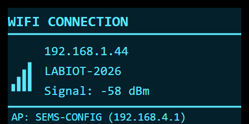
        *   **Halaman 3: Status LAN Detail (IP LAN & Kabel)**
            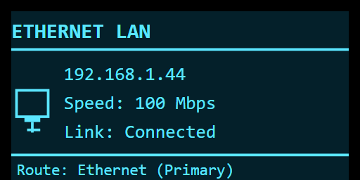
        *   **Halaman 4: Status MQTT Detail (Server Database)**
            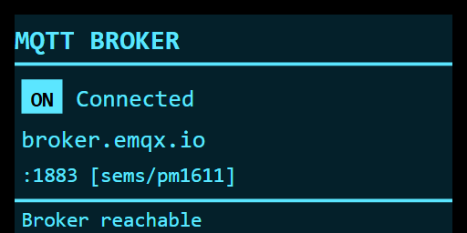

    *   *Cara pakai:* Geser kursor ke menu ini, **tahan sentuh 2 detik** untuk masuk. Ketuk sekali untuk pindah halaman info. **Tahan sentuh 2 detik** di halaman mana saja untuk kembali ke layar depan.
3.  **Exit (Keluar)**
    *   Geser kursor ke menu ini, **tahan sentuh 2 detik** untuk kembali ke layar utama.

---

## 5. Alur Konfigurasi (Cara Setting Alat)

Jika alat baru pertama kali dipasang, atau Anda ingin mengganti password WiFi, menambah meteran, atau mengatur relay, ikuti langkah mudah berikut:

### Langkah 1: Masuk ke Mode Setting

Ada dua cara — pilih salah satu:

*   **Cara cepat:** Tekan dan tahan **tombol BOOT fisik** selama 3 detik. Alat langsung restart ke Config Mode.
*   **Cara lewat menu layar:**
    1. Sentuh dan tahan tombol sensor selama **3 detik** hingga layar masuk ke **Menu Pengaturan**.
    2. Ketuk sekali untuk menggeser tanda panah `>` ke opsi **`1. Boot Mode`**.
    3. Tahan sentuhan selama **2 detik** sampai tulisan berubah menjadi `[CFG]`.

Alat akan mati sejenak dan menyala ulang (restart). Layar depan akan menampilkan tulisan **Config Mode**.

### Langkah 2: Hubungkan HP / Laptop Anda ke WiFi Alat
1. Buka pengaturan WiFi di HP atau laptop Anda.
2. Cari jaringan WiFi baru bernama **`SEMS-SETUP-XXXX`** (misalnya `SEMS-SETUP-A1B2`).
3. Hubungkan/koneksikan ke WiFi tersebut menggunakan password: **`sems1234`**.

### Langkah 3: Buka Halaman Pengaturan di Web Browser
1. Buka aplikasi Google Chrome atau browser bawaan HP Anda.
2. Ketik alamat berikut di kotak pencarian atas: **`192.168.4.1`** (atau ketik **`sems.local`**), lalu tekan Enter.
3. Halaman menu utama pengaturan akan terbuka di layar HP Anda seperti ini:

   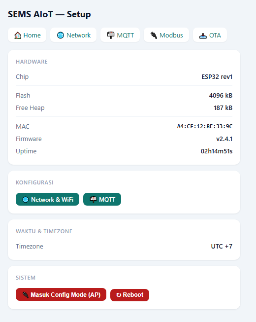

4. Menu navigasi di bagian atas halaman: **Home · Network · MQTT · Modbus · Relay · OTA**.

### Langkah 4: Isi Konfigurasi Alat

*   **Mengatur Internet WiFi & Timezone (Waktu):**
    Pilih menu **Network** di web browser.

    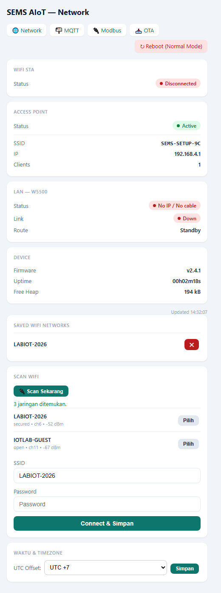

    **Langkah mengatur WiFi:**
    1. Tekan tombol **Scan Sekarang** — alat akan mencari semua jaringan WiFi di sekitarnya (proses berjalan otomatis begitu halaman dibuka).
    2. Daftar jaringan yang ditemukan akan muncul, lengkap dengan info kekuatan sinyal (dBm) dan jenis keamanan (terbuka/terkunci password).
    3. Ketuk tombol **Pilih** pada nama jaringan (SSID) yang diinginkan — nama tersebut otomatis terisi di kolom SSID.
    4. Masukkan **Password** WiFi tersebut, lalu tekan **Connect & Simpan**.
    5. Alat akan **mencoba menyambung dulu** (proses tes koneksi memakan waktu beberapa detik). Jika berhasil, muncul konfirmasi **"Koneksi sukses!"** beserta alamat IP yang didapat, dan jaringan otomatis tersimpan permanen. Jika gagal (password salah/sinyal lemah), muncul pesan error dan jaringan **tidak disimpan** — Anda bisa coba ulangi.
    6. Alat bisa **menyimpan hingga 5 jaringan WiFi sekaligus** (misalnya WiFi kantor + WiFi HP hotspot cadangan). Saat reconnect, alat otomatis mencoba satu per satu dari daftar simpanan sampai salah satu berhasil tersambung.
    7. Jaringan yang sedang aktif tersambung ditandai dengan centang hijau (&#10003;) beserta alamat IP-nya di daftar **Saved WiFi Networks**. Untuk menghapus jaringan tersimpan, tekan tombol **&#10005;** merah di sampingnya (hanya bisa dilakukan saat Config Mode).
    8. Untuk zona waktu, pilih angka **UTC Offset** yang sesuai (misalnya **UTC+7** untuk WIB / Jakarta-Surabaya, **UTC+8** untuk WITA, **UTC+9** untuk WIT), lalu tekan **Simpan**. Jam alat akan otomatis sinkron ulang lewat internet (NTP) begitu tersambung.

    *Catatan: alat menyimpan sambungan terakhir yang berhasil (BSSID & channel) agar proses reconnect di kemudian hari lebih cepat (FastConnect) — tidak perlu scan ulang dari nol setiap kali alat menyala.*

*   **Mengatur MQTT (Pengiriman Data):**
    Pilih menu **MQTT** di web browser untuk memasukkan alamat server broker database pusat data Anda agar alat dapat mulai memposting pembacaan energi.

    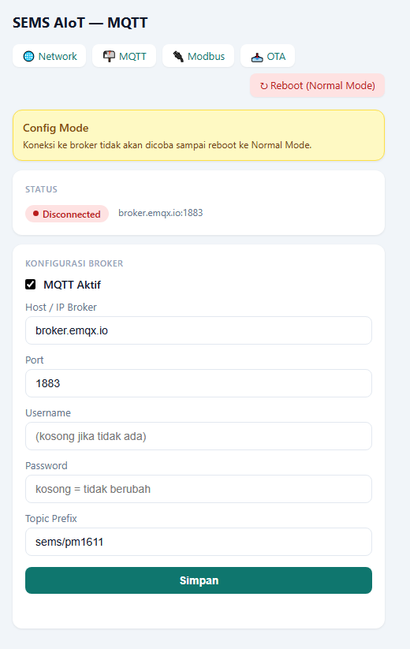

*   **Mengatur Modbus — Multi Power Meter (hingga 4 unit):**
    Pilih menu **Modbus** untuk menambah/mengatur meteran listrik yang tersambung ke terminal RS485. Alat mendukung **hingga 4 meteran sekaligus** dalam satu jalur kabel (bergantian dibaca otomatis, sistem "round-robin").

    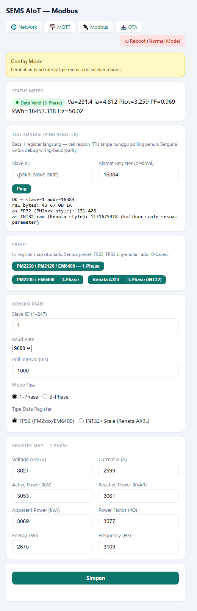

    Untuk tiap slot meteran, isi:
    1. **Aktifkan Slot** — centang untuk mengaktifkan meter di slot ini.
    2. **Label** — nama bebas untuk memudahkan identifikasi (misal "PM Lantai 1").
    3. **Tipe Meter** — pilih sesuai merek/tipe alat ukur yang dipasang:
       - **FP32 (Schneider PM/EM)** — untuk Schneider PM2xxx/EM6400 dan sejenisnya (format data desimal/float).
       - **INT32 (Renata AX9L 3P)** — untuk Renata AX9L yang dipasang 3-fasa.
       - **INT32 (Renata AX9L 1P)** — untuk Renata AX9L yang dipasang 1-fasa saja (fasa B/C tidak dipakai).
    4. **Slave ID (1-247)** — alamat Modbus unik meteran tersebut (harus sesuai dengan setelan fisik di meteran, biasanya diatur lewat DIP-switch atau menu di alat meter itu sendiri). **Setiap meteran di satu jalur kabel wajib punya Slave ID yang berbeda-beda.**
    5. **Poll (ms)** — jeda waktu antar-pembacaan meter ini, dalam milidetik (default 3000 = tiap 3 detik).
    6. **Mode Fasa** — 1-Phase atau 3-Phase, sesuai instalasi fisik dan menentukan bentuk data yang dikirim ke server.
    7. **MQTT Base Topic & Suffix** — alamat topik pengiriman data untuk meter ini (biasanya sudah diisi otomatis oleh tim teknis, tidak perlu diubah kecuali diminta).
    8. **Register Map Lanjutan** (bagian yang bisa dibuka/tutup) — pengaturan lanjutan alamat register Modbus, hanya perlu diubah jika memakai tipe meteran yang tidak standar. Tersedia tombol Preset untuk mengisi otomatis sesuai tipe meter umum.

    > **Penting:** Semua meteran dalam satu jalur RS485 (kabel A/B yang sama) harus memakai **kecepatan komunikasi (Baud Rate) dan Parity yang sama** — pengaturan ini bersifat satu untuk seluruh jalur (bukan per-meteran), diatur di panel **"RS485 Bus"** pada halaman Modbus yang sama.

*   **Mengatur Relay — Kontrol 4-Channel:**
    Pilih menu **Relay** untuk menyalakan/mematikan 4 keluaran relay dari jarak jauh, baik lewat halaman web ini maupun otomatis lewat MQTT.

    Pada halaman ini Anda bisa:
    1. **Menyalakan/mematikan tiap relay satu-satu** — tekan saklar (toggle) di samping nama Relay 1/2/3/4.
    2. **Semua ON / Semua OFF** — tombol untuk mengendalikan keempat relay sekaligus.
    3. **Status relay** ditampilkan sebagai badge: `ON` (hijau, menyala), `OFF` (abu-abu, mati), atau `TRIP` (merah, mati otomatis karena proteksi arus lebih).
    4. **Pengaturan lanjutan** (hanya di Config Mode):
       - **Relay Aktif** — saklar utama, jika dimatikan semua relay otomatis OFF.
       - **Active-High/Low** — polaritas sinyal keluaran, disesuaikan dengan jenis modul relay yang dipasang (tanyakan ke teknisi jika tidak yakin).
       - **Auto-Retry setelah Trip** — jika diaktifkan, relay yang mati otomatis (TRIP) karena kelebihan arus akan dicoba nyalakan ulang otomatis setelah jeda waktu tertentu.
       - **Batas Arus (A)** — ambang arus listrik maksimum sebelum relay otomatis TRIP (mati sendiri untuk proteksi). Isi 0 untuk menonaktifkan proteksi ini.
       - **GPIO Pin R1-R4** — nomor pin fisik di board untuk tiap relay (sudah diatur pabrik, jangan diubah kecuali oleh teknisi).

### Langkah 5: Kembali ke Mode Kerja Normal
1. Jika semua pengaturan sudah disimpan, kembali ke alat fisik.
2. Sentuh dan tahan sensor tombol selama **3 detik** untuk masuk kembali ke **Menu Pengaturan**.
3. Ketuk sekali ke opsi **`1. Boot Mode`**, lalu tahan sentuh **2 detik** agar statusnya berubah kembali menjadi `[NRM]` (Normal).
4. Alat akan restart dan otomatis terhubung ke WiFi kantor/rumah Anda serta mulai mengirim data energi ke server pusat.

---

## 6. Cara Kerja Pengiriman Data ke Server (MQTT)

Alat mengirim dua jenis data secara berkala ke server pusat, dengan jadwal yang diatur otomatis mengikuti jam alat (RTC):

*   **Data Real-time (Tegangan, Arus, Daya):** dikirim **3 kali per menit** untuk tiap meteran, dijadwalkan bergiliran per detik supaya tidak menumpuk (misalnya meter pertama di detik `:01/:21/:41`, meter kedua di detik `:02/:22/:42`, dan seterusnya).
*   **Data Energi Akumulasi (kWh):** dikirim **1 kali per menit** untuk tiap meteran, juga dijadwalkan bergiliran per detik (meter pertama di detik `:01`, meter kedua di detik `:02`, dst).

Jika jam alat belum tersinkron dengan internet (NTP), alat sementara mengirim data dengan jeda waktu tetap sampai jam berhasil disinkronkan, lalu otomatis berpindah ke jadwal presisi-detik di atas.

---

## 7. Ringkasan Spesifikasi Alat

| Fitur | Penjelasan Sederhana |
| :--- | :--- |
| **Sumber Daya Listrik** | Adaptor DC (Mendukung tegangan adaptor 9 Volt sampai 36 Volt) |
| **Koneksi Internet** | Kabel LAN (Ethernet) atau Wi-Fi |
| **Komunikasi Data Meteran** | Protokol RS485 Modbus RTU (Terminal Blok 3-pin), mendukung **hingga 4 meteran sekaligus** dalam satu jalur |
| **Tipe Meteran Didukung** | Schneider PM2xxx/EM6400 (FP32), Renata AX9L 1-Fasa & 3-Fasa (INT32) |
| **Kontrol Relay** | 4 channel keluaran, dengan proteksi arus lebih (trip otomatis) dan auto-retry opsional |
| **Tombol Kontrol** | Dua tombol fisik — sentuh (navigasi menu layar) dan BOOT (jalan pintas Config Mode) |
| **Layar Informasi** | Layar kecil 2 warna (Kuning di atas, Biru di bawah), 5 halaman info berputar otomatis |
| **Pengiriman Data** | MQTT, terjadwal otomatis mengikuti jam alat (RTC) untuk mengurangi beban jaringan |
